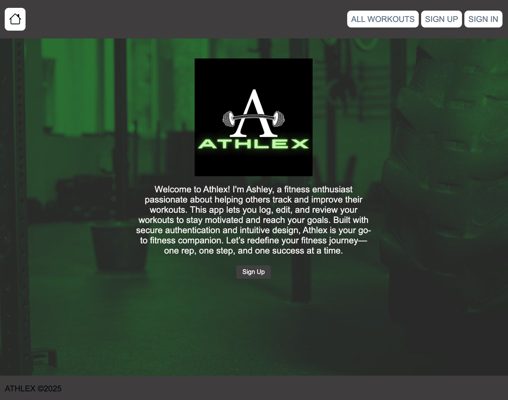
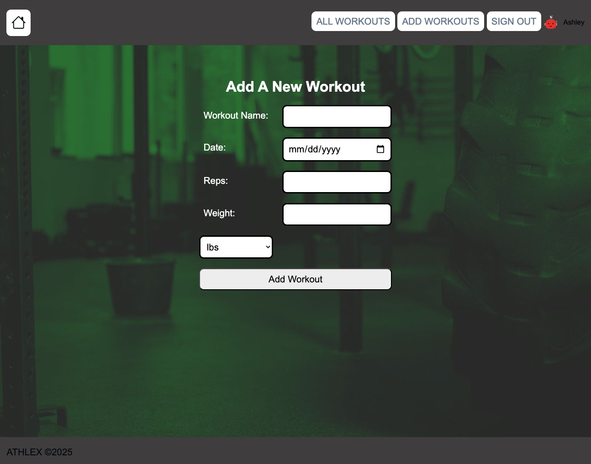
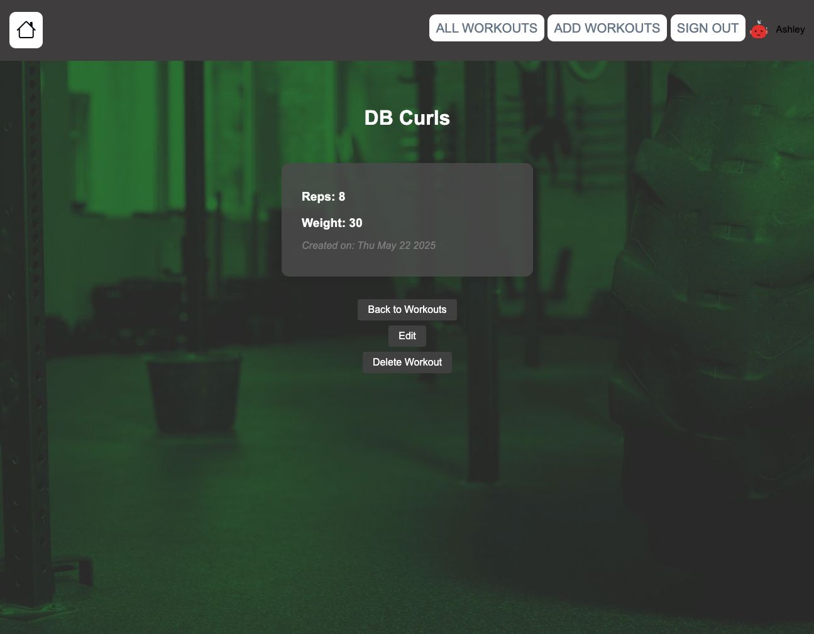

# Welcome to Athlex 🦾
Athlex is a fitness tracking web application that allows users to log, edit, and review their workouts. Built with Node.js, Express, MongoDB, and EJS, Athlex helps users stay motivated and reach their fitness goals.

[Click to visit Athlex](https://athlexs-a931aa1fe713.herokuapp.com/)

## Screenshots 📷

**Home Page** 
**Add Workout** 
**Workout Description** 

## Features 🎨

- User authentication (sign up, sign in, sign out)
- Add, edit, and delete workouts
- Each user can only view and manage their own workouts
- Responsive and modern UI with avatars and background images
- Secure routes so only logged-in users can access workout features

## Tech Stack 💻

- Node.js
- Express.js
- MongoDB & Mongoose
- EJS (Embedded JavaScript templates)
- CSS (custom & Bootstrap Icons)

## Customization

- **Avatars:** User avatars are generated using DiceBear and are unique per user.

## IceBox Features 🧊

- Implement a timer for cardio workout
- Add a gps feature to log miles for runs/walks
- Suggested Workout playlist 